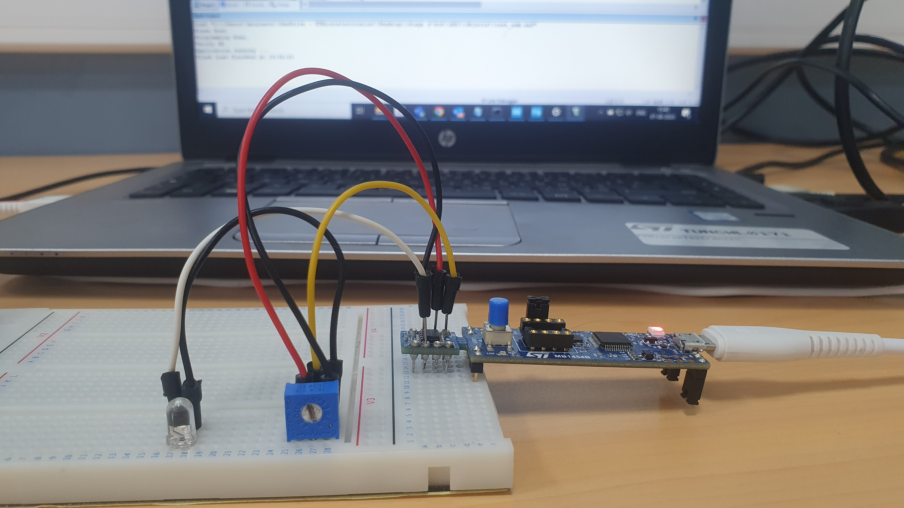
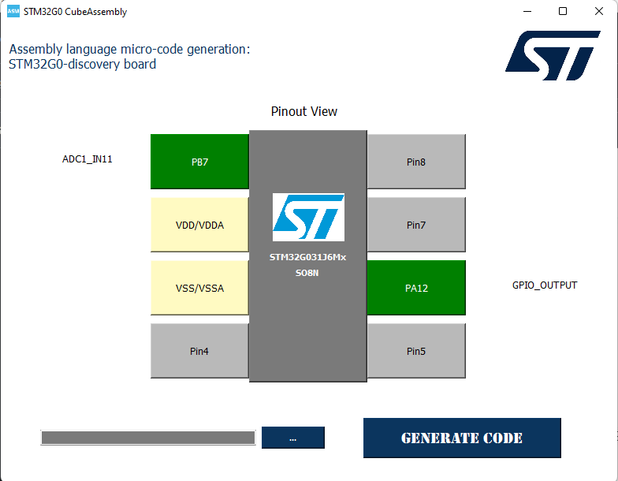
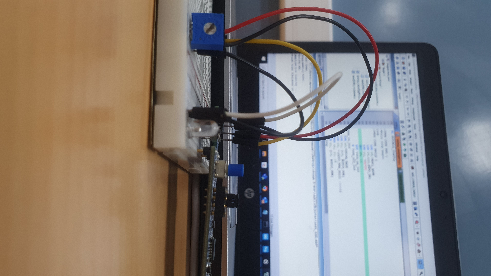

# ADC Application

 

## Description of the ADC Application
The goal of this application is to control the state of an LED (PA15) by reading the ADC value from a potentiometer. A threshold value is set (0x7FF, approximately 2V), beyond which the LED's state changes.

### Operation:
- **LED**: PA15 (or external LED connected).
- **Threshold**: 0x7FF (approximately 2V). When the ADC value exceeds this threshold, the LED's state toggles.

## Configuration Interface: STM32G0 CubeAssembly

For configuring the ADC example, the following interface from the **STM32G0 CubeAssembly** tool was used. This tool simplifies the configuration of the STM32G0-discovery board and automatically generates the assembly code needed for the selected peripherals.

  

- **Pinout View**: Shows the selected pin configuration for the STM32G031J6Mx chip, highlighting the pins used for the example.
- **Peripheral Selection**: ADC1 IN11 (PB7) is configured for analog input, and GPIO PA12 is configured as an output for indicating the ADC reading status.
- **Generate Code**: The tool allows you to automatically generate the base configuration code for the selected peripherals.

Once this configuration is set, the generated assembly code is included in the example's `main.s` file for direct use with the STM32G0. You should focus only on developing the **user-specific code** in the designated areas (marked by `;USER CODE BEGIN` and `;USER CODE END`), while the configuration code for peripherals and clock management is handled by the tool.

### Wiring:
- **Pin 1**: Potentiometer
- **Pin 6**: External LED (optional, as LD2 is already connected to PA15)

### Explanation:
The ADC (Analog-to-Digital Converter) reads the voltage from the potentiometer and compares it to the threshold value. If the voltage exceeds this threshold, the LED will turn on or off accordingly.

---

## Video Demonstration

Click the image above to watch the video demonstration of this example.

