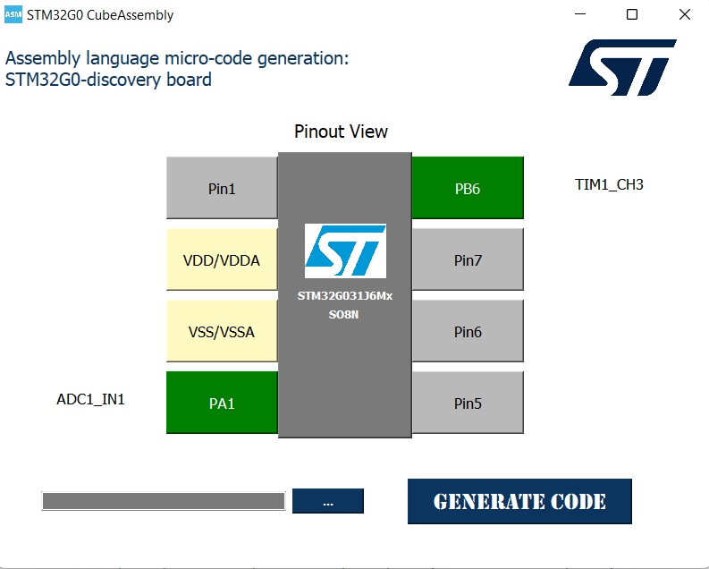

# PWM Application

 <!-- Replace with the correct image path if necessary -->

## Description of the PWM Application

This application demonstrates the combined use of two peripherals: **ADC** and **TIMER** configured for PWM (Pulse Width Modulation).

### Objective
The goal is to read the **ADC input** from a potentiometer, which provides varying values that are used to set the **duty cycle** of the PWM signal. The PWM signal is configured on **Pin 8**.

## Configuration Interface: STM32G0 AssemblyCube

For configuring the PWM example, the following interface from the **STM32G0 AssemblyCube** tool was used. This tool simplifies the configuration of the STM32G0-discovery board and automatically generates the assembly code needed for the selected peripherals.

  

- **Pinout View**: Shows the selected pin configuration for the STM32G031J6Mx chip, highlighting the pins used for the example.
- **Peripheral Selection**: TIM1 Channel 3 (PB6) is configured for the PWM signal output, and ADC1_IN1 (PA1) is configured for the analog input.
- **Generate Code**: The tool allows you to automatically generate the base configuration code for the selected peripherals.

Once this configuration is set, the generated assembly code is included in the example's `main.s` file for direct use with the STM32G0. You should focus only on developing the **user-specific code** in the designated areas (marked by `;USER CODE BEGIN` and `;USER CODE END`), while the configuration code for peripherals and clock management is handled by the tool.

### Wiring:
- **Pin 4**: Connected to the potentiometer (ADC input).
- **Pin 8**: Connected to an oscilloscope (to visualize the PWM signal).

### Code Breakdown:
- The **ADC** is configured to read input from the potentiometer connected to **Pin 4** (ADC channel 11).
- The **TIMER 2 (TIM2)** is configured to generate a PWM signal on **Channel 2** (Pin 8).
  - The **prescaler** is set to 1599, and the **auto-reload value (ARR)** is set to 1000 to determine the PWM frequency.
  - The **duty cycle** is dynamically adjusted based on the ADC input from the potentiometer.
- The **PWM signal** is visualized on **Pin 8** using an oscilloscope.

---

## Video Demonstration

Click the image above to watch the video demonstration of this example.

