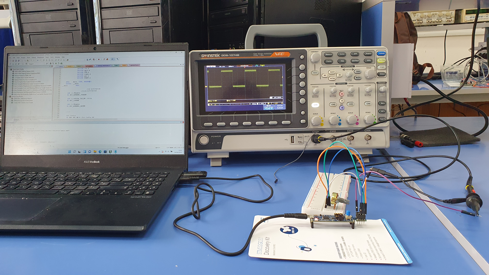
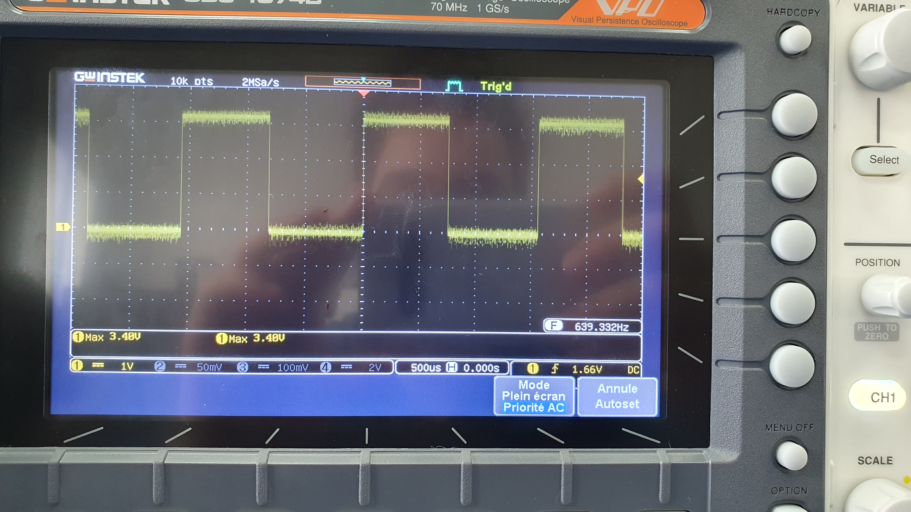

# PWM Application

 <!-- Replace with the correct image path if necessary -->

## Description of the PWM Application

This application demonstrates the combined use of two peripherals: **ADC** and **TIMER** configured for PWM (Pulse Width Modulation).

### Objective
The goal is to read the **ADC input** from a potentiometer, which provides varying values that are used to set the **duty cycle** of the PWM signal. The PWM signal is configured on **Pin 8**.

### Wiring:
- **Pin 4**: Connected to the potentiometer (ADC input).
- **Pin 8**: Connected to an oscilloscope (to visualize the PWM signal).

### Code Breakdown:
- The **ADC** is configured to read input from the potentiometer connected to **Pin 4** (ADC channel 11).
- The **TIMER 2 (TIM2)** is configured to generate a PWM signal on **Channel 2** (Pin 8).
  - The **prescaler** is set to 1599, and the **auto-reload value (ARR)** is set to 1000 to determine the PWM frequency.
  - The **duty cycle** is dynamically adjusted based on the ADC input from the potentiometer.
- The **PWM signal** is visualized on **Pin 8** using an oscilloscope.

---

## Video Demonstration

Click the image above to watch the video demonstration of this example.

