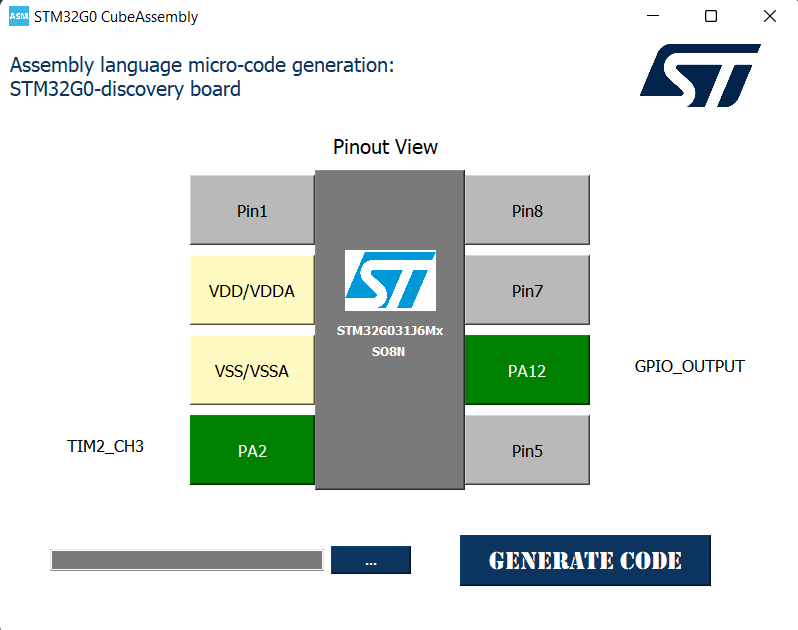

# TIMER Example

## Application: TIMER

### Objective
This example demonstrates how to use **TIM2** (Timer 2) to blink an LED at a fixed interval. The parameters of the timer are set to create a delay for the blinking.

- The prescaler (`TIM_PSC`) is set to **15999** to obtain a frequency of **1000 Hz** based on the following formula:
Desired Frequency = Timer's Clock Frequency / (Prescaler + 1)

  
  - With **Timer's Clock Frequency = 16 MHz**

## Configuration Interface: STM32G0 AssemblyCube

For configuring the Timer example, the following interface from the **STM32G0 AssemblyCube** tool was used. This tool simplifies the configuration of the STM32G0-discovery board and automatically generates the assembly code needed for the selected peripherals.

  

- **Pinout View**: Shows the selected pin configuration for the STM32G031J6Mx chip, highlighting the pins used for the example.
- **Peripheral Selection**: TIM2 Channel 3 (PA2) is configured for the Timer.
- **Generate Code**: The tool allows you to automatically generate the base configuration code for the selected peripherals.

Once this configuration is set, the generated assembly code is included in the example's `main.s` file for direct use with the STM32G0. You should focus only on developing the **user-specific code** in the designated areas. These are clearly marked in the generated assembly code with comments such as `;USER CODE BEGIN` and `;USER CODE END`. 

This ensures that the configuration code, including clock setup and peripheral initialization, is already handled by the tool, and you only need to focus on writing the functional logic.

### Wiring
- No wiring is required. It is optional to connect an LED to **PA12 (Pin 6)** if external indication is desired.

---

## Video Demonstration

Click the image above to watch the video demonstration of this example.
