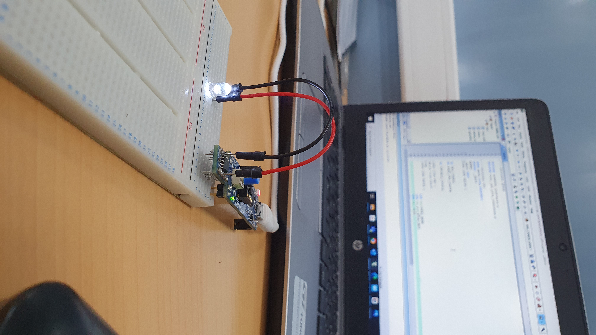

# TIMER Example

## Application: TIMER

### Objective
This example demonstrates how to use **TIM2** (Timer 2) to blink an LED at a fixed interval. The parameters of the timer are set to create a delay for the blinking.

- The prescaler (`TIM_PSC`) is set to **15999** to obtain a frequency of **1000 Hz** based on the following formula:
  $  \text{DesiredFrequency} = \frac{\text{Timer's Clock Frequency}}{\text{Prescaler} + 1}$
  
  - With **Timer's Clock Frequency = 16 MHz**

### Wiring
- No wiring is required. It is optional to connect an LED to **PA12 (Pin 6)** if external indication is desired.

---

## Video Demonstration

Click the image above to watch the video demonstration of this example.
