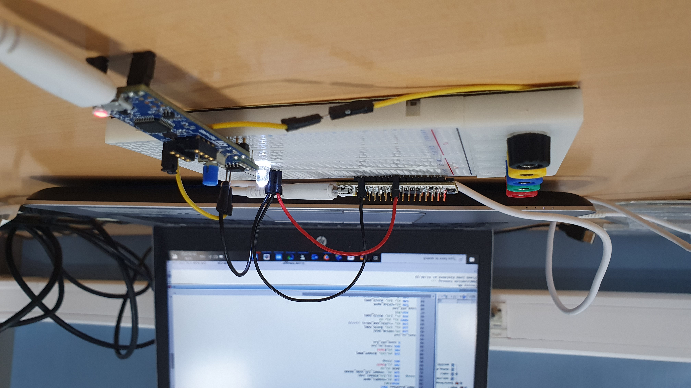
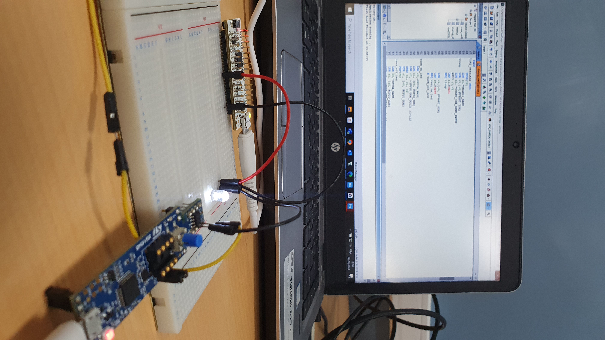
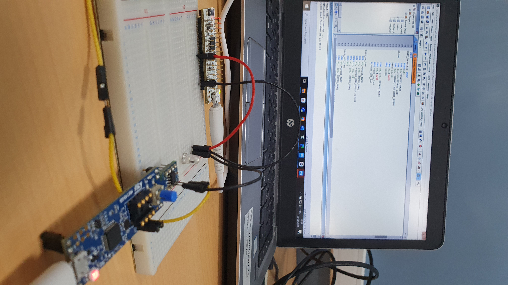

# USART RXTX Application

 <!-- Replace with the correct image path if necessary -->

## Description
This application combines both the RX and TX functionalities into two separate boards:
- One board is programmed as the **TX** (transmitter), which alternates between sending the characters `'Y'` and `'N'` with a delay in between.
- The other board is programmed as the **RX** (receiver), which responds to the transmitted message by changing the state of the LED (LD2).
  - `'Y'` turns the LED on.
  - `'N'` turns the LED off.

### Wiring:
- The grounds of both boards should be connected.
- **Pin 4 of the TX** board is connected to **Pin 1 of the RX** board.
- The LED can be connected to **PA12** (optional, as LD2 on the board can be used).

---

## Video Demonstrations

### 1. Without Bluetooth Module

---

### 2. With Bluetooth Module

Click the images above to watch the video demonstrations.
