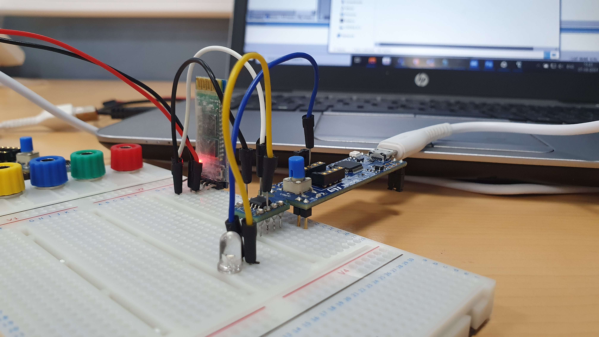
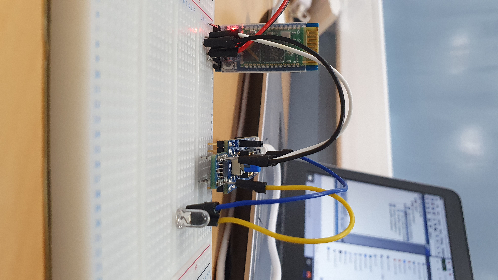

# USART RX Example

 <!-- Replace with the correct image path if necessary -->

## Description
This application controls the state of an LED (on/off) depending on the message received via UART:
- Sending `'Y'` turns the LED on.
- Sending any other character turns the LED off.

## Configuration Interface: STM32G0 AssemblyCube

For configuring the USART RX example, the following interface from the **STM32G0 AssemblyCube** tool was used. This tool simplifies the configuration of the STM32G0-discovery board and automatically generates the assembly code needed for the selected peripherals.

  

- **Pinout View**: Shows the selected pin configuration for the STM32G031J6Mx chip, highlighting the pins used for the example.
- **Peripheral Selection**: USART1 RX (PB7) is configured for receiving data over the USART protocol, while GPIO pin PA12 is configured as an output for indicating reception status.
- **Generate Code**: The tool allows you to automatically generate the base configuration code for the selected peripherals.

Once this configuration is set, the generated assembly code is included in the example's `main.s` file for direct use with the STM32G0. You should focus only on developing the **user-specific code** in the designated areas (marked by `;USER CODE BEGIN` and `;USER CODE END`), while the configuration code for peripherals and clock management is handled by the tool.

### Wiring:
- **Pin 1 (PB7 : USART1_RX)**: Connected to the TX pin of the Bluetooth/USART module.
- **Power**: The Bluetooth module is powered by a 5V supply (from another board, as the STM32G0 only provides 3.3V output).
  - In this case, the ground of both boards should be connected.
- **Pin 6 (PA15)**: Connected to the LED (optional).

---

## Video Demonstration

Click the image above to watch the video demonstration of this example.

