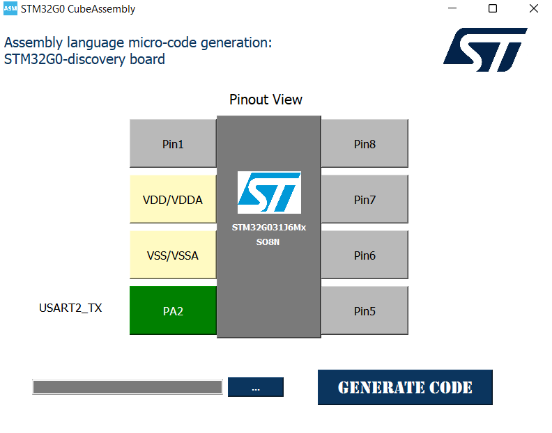

# USART TX Example

 <!-- Replace with the correct image path if necessary -->

## Description
This application sends two characters, `'Y'` and `'N'`, over the USART2 interface at regular intervals:
- **'Y'** is sent first, followed by a delay.
- **'N'** is sent next, followed by another delay.

This cycle repeats indefinitely, and the characters are transmitted to the connected Bluetooth/USART module.
## Configuration Interface: STM32G0 CubeAssembly

For configuring the USART TX example, the following interface from the **STM32G0 CubeAssembly** tool was used. This tool simplifies the configuration of the STM32G0-discovery board and automatically generates the assembly code needed for the selected peripherals.

  

- **Pinout View**: Shows the selected pin configuration for the STM32G031J6Mx chip, highlighting the pins used for the example.
- **Peripheral Selection**: USART2 TX (PA2) is configured for transmitting data over the USART protocol.
- **Generate Code**: The tool allows you to automatically generate the base configuration code for the selected peripherals.

Once this configuration is set, the generated assembly code is included in the example's `main.s` file for direct use with the STM32G0. You should focus only on developing the **user-specific code** in the designated areas (marked by `;USER CODE BEGIN` and `;USER CODE END`), while the configuration code for peripherals and clock management is handled by the tool.

### Wiring:
- **Pin 4 (PA2 : USART2_TX)**: Connected to the TX pin of the Bluetooth/USART module.
- **Power**: The Bluetooth module is powered by a 5V supply (from another board, as the STM32G0 only provides 3.3V output).
  - The grounds of both boards must be connected together.

---

## Video Demonstration

Click the image above to watch the video demonstration of this example.
