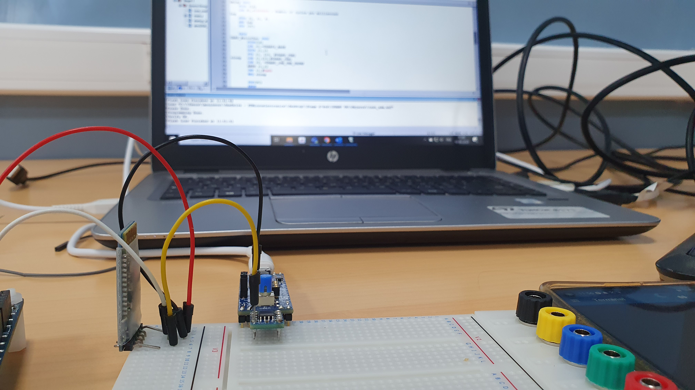
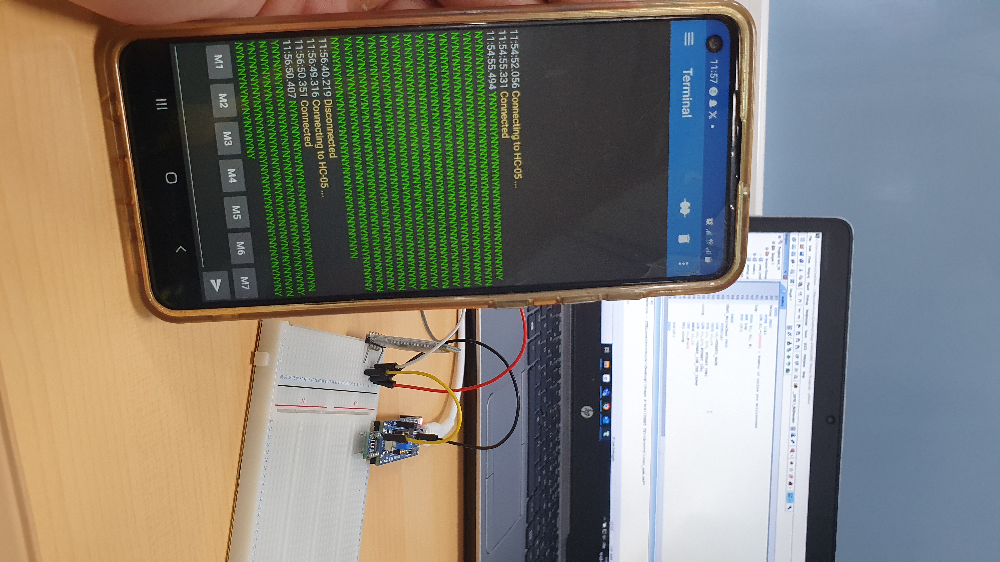

# USART TX Example

 <!-- Replace with the correct image path if necessary -->

## Description
This application controls the state of an LED (on/off) by sending a message via UART:
- Sending `'Y'` turns the LED on.
- Sending any other character turns the LED off.

### Wiring:
- **Pin 1 (PB7 : USART1_RX)**: Connected to the TX pin of the Bluetooth/USART module.
- **Power**: The Bluetooth module is powered by a 5V supply (from another board, as the STM32G0 only provides 3.3V output).
  - In this case, the ground of both boards should be connected.
- **Pin 6 (PA15)**: Connected to the LED (optional).

---

## Video Demonstration

Click the image above to watch the video demonstration of this example.

