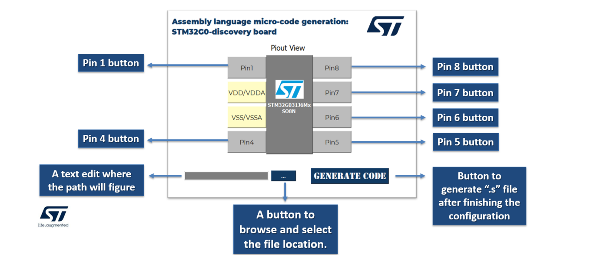
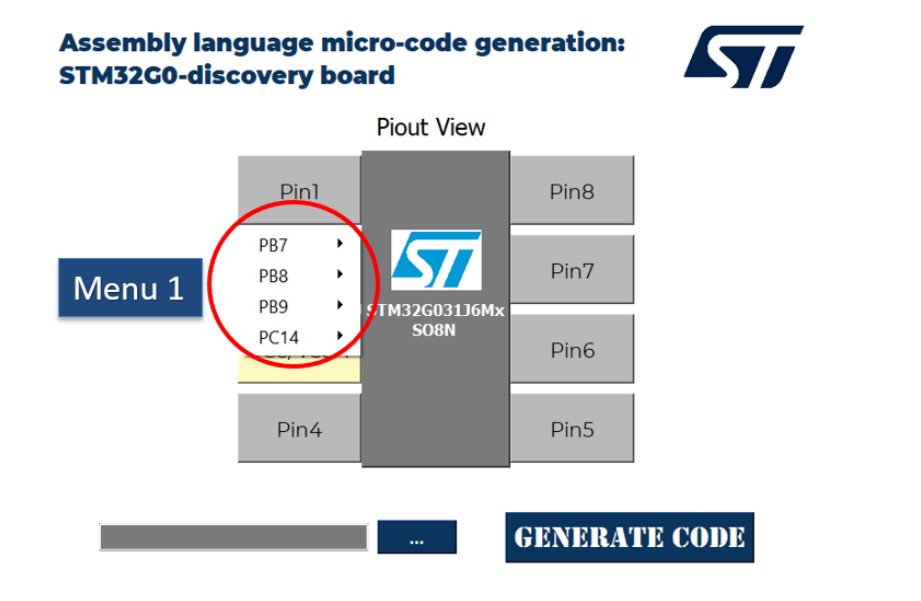
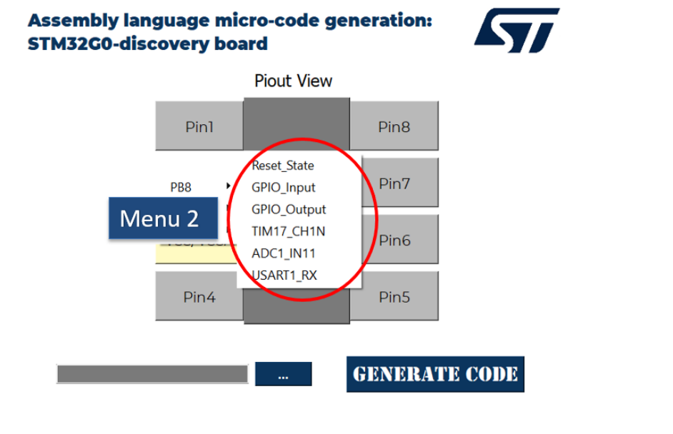

# STM32G0 Assembly Code Generator

This project, developed during the 2022/2023 academic year at the **National Engineering School of Tunis**, in collaboration with **ST Microelectronics Tunis**, aims at generating assembly language micro-code for the STM32G0-Discovery board. The goal is to facilitate peripheral configuration by providing a graphical interface that automatically generates the necessary assembly code.

## Table of Contents
- [Overview](#overview)
- [Features](#features)
- [Installation](#installation)
- [Usage](#usage)
- [Examples: Basic applications configured using the interface's generated code ](#Examples)
- [SourceCode: Interface's source code written in c++ implemented with QT](#Source-Code)
- [Acknowledgments](#acknowledgments)

## Overview

The main objective of this project is to develop a tool that simplifies the configuration of STM32G0-Discovery board peripherals using assembly language. The graphical interface enables users to configure settings easily, and it automatically generates the corresponding assembly code.

This project was carried out as a part of the curriculum at the National Engineering School of Tunis in collaboration with ST Microelectronics during the academic year 2022/2023.

## Features

- **Graphical User Interface (GUI):** User-friendly interface for configuring STM32G0-Discovery board peripherals.
- **Assembly Code Generation:** Automatic generation of assembly code based on the user's peripheral configuration.
- **Peripheral Support:** Provides support for configuring various peripherals (GPIO, UART, etc.) of the STM32G0 board.
- **Microcontroller:** Designed specifically for the STM32G0 family.

## Installation
   Use the Installer provided in the main directory

### Prerequisite
- Keil µVision (or any other STM32 development environment)
- STM32G0-Discovery board

### Usage

    
   
   
    
   
 

### Examples
**Look into the "Examples directory**:
In this project we tested our developed interface generated configuration code to assure its functionality. The configured peripherals are the following:
<ul>
  <li>GPIO</li>
  <li>ADC</li>
  <li>TIMER</li>
  <li>USART</li>
</ul>

